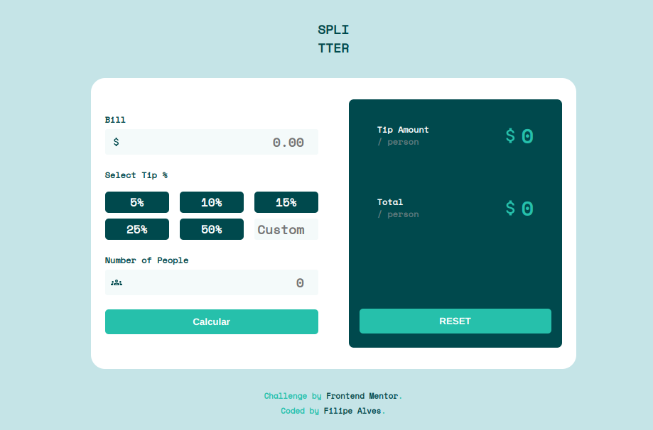
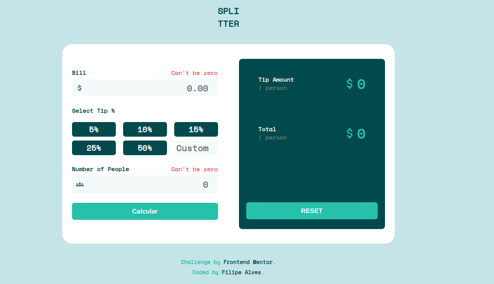
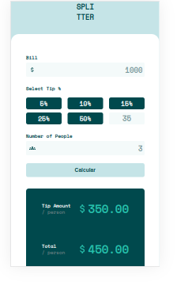
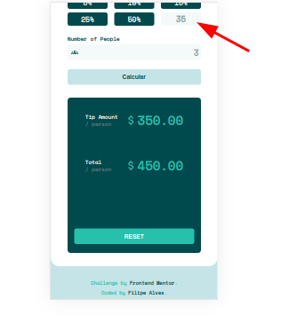
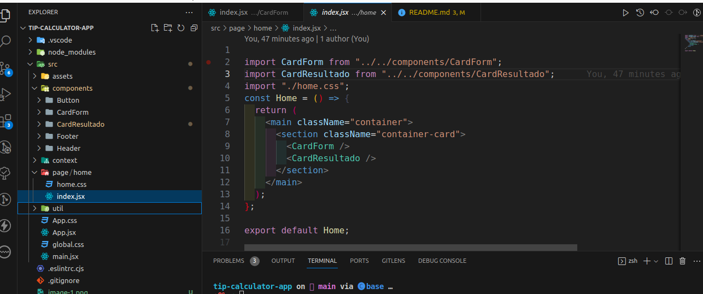

# Welcome! 👋

## Frontend Mentor - Tip calculator app solution

This is a solution to the [Tip calculator app challenge on Frontend Mentor](https://www.frontendmentor.io/challenges/tip-calculator-app-ugJNGbJUX). Os desafios do Frontend Mentor ajudam você a melhorar suas habilidades de codificação através da construção de projetos realistas.

### Índice

- [Visão geral](#visão-geral)
  - [O desafio](#o-desafio)
  - [Screenshot](#screenshot)
  - [Links](#links)
- [Desenvolvimento](#desenvolvimento)
  - [Tecnologias](#tecnologias)
  - [Aprendizado](#aprendizado)
  - [Próximos Passos](#próximos-passos)
- [Autor](#autor)

### Visão geral

#### O desafio

- Construir um aplicativo que calcula gorjetas(Tip calculator).
  - Layout responsivo;
  - Ter os estados de foco para todos os elementos interativos na página;
  - Calcular a gorjeta correta e o custo total da conta por pessoa.

#### Screenshot






#### Links

- Solution URL: [Tip Calculator app](https://tip-calculator-nine-red.vercel.app/)

### Desenvolvimento

#### Tecnologias

- HTML5 semântica
- CSS
- Flexbox
- Layout Responsivo
- [React](https://reactjs.org/) - Documentação
- [React Hook Form](https://react-hook-form.com/) - Documentação
- [React Icons](https://react-icons.github.io/react-icons) - Documentação
- [Yup](https://www.npmjs.com/package/yup) - Documentação

#### Aprendizado

Esse projeto tem como objetivo praticar o desenvolvimento web com React, o principal conceito colocado em prática foi o uso de formulário rativo com o React Hook Form. Foi utilizado o yup integrado com react-hook-form para criar as validação, por fim utilizei o react-icons para adicionar os ícones do input.

- Exemplo de parte do código usando o React Hook Form:

```js
import { useForm } from "react-hook-form";
const {
    register,
    handleSubmit,
    formState: { errors },
  } = useForm({ resolver: yupResolver(schema) });

  <form onSubmit={handleSubmit(onSubmit)}>
        <fieldset>
          <legend>
            Bill
            <span className="error" role="alert">
              {errors.conta?.message}
            </span>
          </legend>
          <div className="input-icons">
            <MdAttachMoney className="icons" />
            <input
              className="input"
              type="texto"
              placeholder="0.00"
              {...register("conta", { required: true, min: 1 })}
              aria-invalid={errors.conta ? "true" : "false"}
            />
          </div>
        </fieldset>
```

- Exemplo da função que calcula a gorjeta o valor total por pessoa:

```js
export const CalculoTaxaServico = (valor, percento) => {
  const taxaServico = (parseFloat(valor) * parseInt(percento)) / 100;
  return taxaServico.toFixed(2);
};
```

- Estrutura do projeto:



#### Próximos Passos

Continuarei estudando React, pretendo explorar mais o react-hook-form e para estilização usar styled-components.

### Autor

- Linkedin - [Filipe Alves](https://www.linkedin.com/in/filipeqalves/)
- Frontend Mentor - [@lipeqalves](https://www.frontendmentor.io/profile/lipeqalves)
